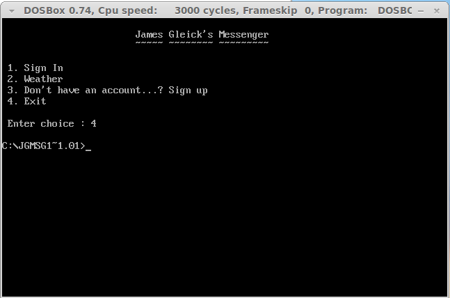
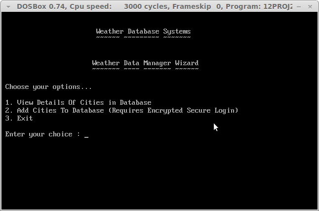

# James Gleick Messenger

## ?!
An old-school 1970 model C++ terminal messenger client that works on a single machine. Built for Windows and compiles only with Borland C++. Use  [DOSBox](http://www.dosbox.com/) or a NT machine prior to Vista to view it full screen.

## Screenshots

## Download

A win32 executable is also available for [download](https://github.com/dtsdwarak/james_gleick_messenger/blob/master/JG%20MSG%201.01.exe?raw=true).

***
Built for Fun with lots of ~~:heart:~~

