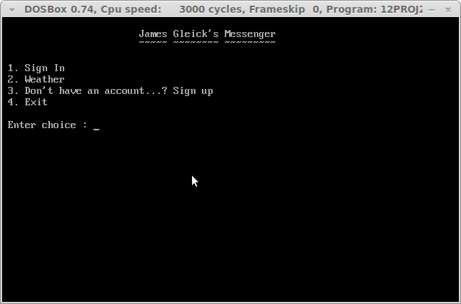
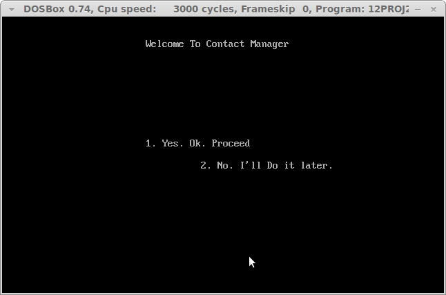

#James Gleick Messenger#

##?!
An old-school 1970 model C++ terminal messenger client that works on a single machine. Built for Windows and compiles only with Borland C++. Use  [DOSBox](http://www.dosbox.com/) or a NT machine prior to Vista to view it full screen.

##Screenshots

***
Built for Fun with lots of ~~:heart:~~

